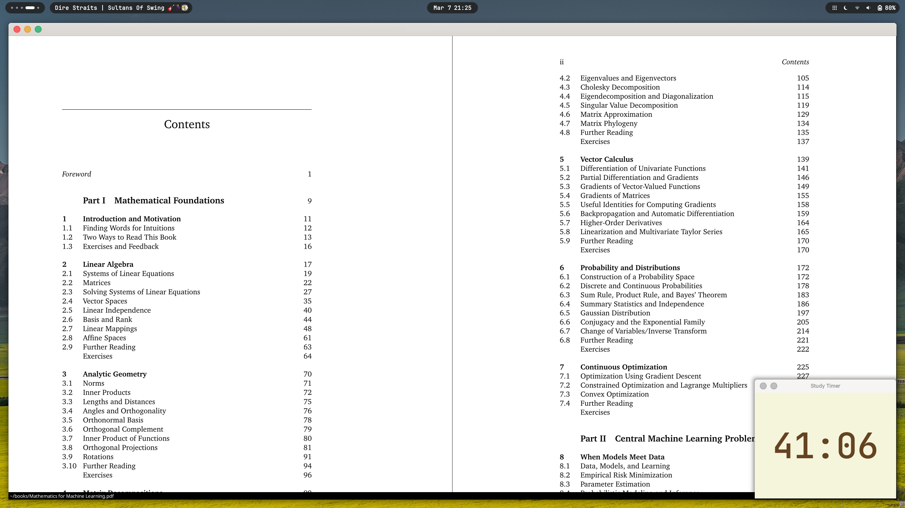

# study timer

A small study timer window created with SDL2 in C, currently with a default time of 45 minutes.
Clicking on the timer pauses it, clicking again continues the countdown.

The timer on the top left:


Compile the source using:

```sh
gcc timer.c -o timer.out -lSDL2 -lSDL2_ttf
```
#### Global desktop install:

I made a install script to install the app globally on your system, so it can be run like any other desktop app.
To install it, just run the following command:

```bash
sudo chmod +x install.sh
./install.sh
```
